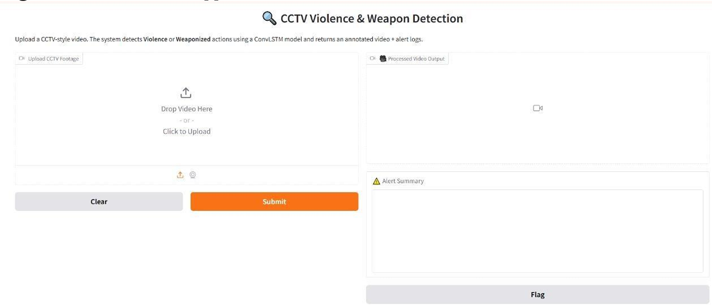
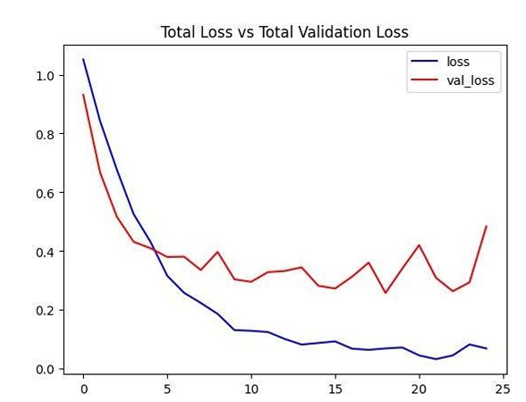
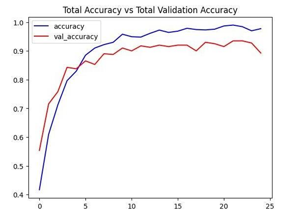
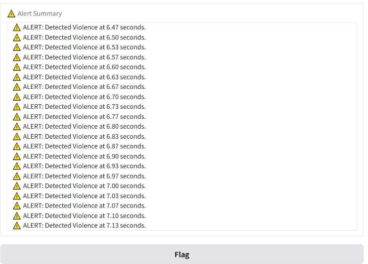

# CCTV-Based Activity Recognition using ConvLSTM

Real-time surveillance system that automatically classifies CCTV footage into
**Normal**, **Violence**, or **Weaponized** activity using a ConvLSTM deep
learning model — built to reduce reliance on manual human monitoring and
enable faster response to security threats.



## Problem

Most CCTV systems still depend on human operators watching live feeds —
which is labor-intensive and prone to fatigue-driven error. This project
automates threat detection directly from raw video, flagging violent or
weapon-related activity without requiring constant human attention.

## Approach

The model uses a **ConvLSTM (Convolutional LSTM)** architecture, which
learns spatial features (via convolution) and temporal motion patterns
(via LSTM gates) in a single network — necessary because standard image
classifiers can't capture how actions evolve over time across frames.

**Pipeline:**
1. Extract 20 evenly-sampled frames per video, resize to 64×64, normalize
2. Feed frame sequences through 4 stacked ConvLSTM2D layers (filters: 4 → 8 → 14 → 16)
   with MaxPooling3D and TimeDistributed Dropout after each
3. Flatten → Dense(3, softmax) for final classification
4. Real-time inference via a rolling frame buffer, with predictions overlaid on video
5. Deployed through a Gradio web interface for non-technical usability



## Results

| Metric | Value |
|---|---|
| Test Accuracy | **91.63%** |
| Test Loss | 0.2752 |
| Validation Accuracy (stabilized) | ~94–95% |



## Demo

Upload CCTV-style footage → the app returns an annotated video with live
predictions plus a timestamped alert log for any non-"Normal" activity detected.




## Tech Stack

`Python` · `TensorFlow / Keras` · `OpenCV` · `NumPy` · `Scikit-learn` · `Gradio` · `MoviePy`

## Dataset

[SCVD (Surveillance Camera Violence Detection)](https://www.kaggle.com/datasets/toluwaniaremu/smartcity-cctv-violence-detection-dataset-scvd) dataset
from Kaggle — CCTV footage labeled across three classes: Normal, Violence,
Weaponized.

## Setup & Usage

```bash
git clone https://github.com/RajDwivedi18/cctv-activity-recognition-convlstm.git
cd cctv-activity-recognition-convlstm
pip install -r requirements.txt
python app/gradio_app.py
```

## Limitations & Future Work

- Fixed 20-frame sequence length introduces slight prediction latency —
  not yet suited for zero-delay real-time streams
- Limited to 3 activity classes (Normal/Violence/Weaponized); doesn't yet
  detect vandalism, trespassing, or loitering
- Planned: live camera stream integration, explainability via saliency maps,
  multi-camera event correlation
  
## License

[MIT](LICENSE) 
